# ESS 배터리 수명 예측

초기 100사이클의 측정 데이터로 제공된 배터리 총 수명 `cycle_life`를 회귀 예측하고, 별도 실험 배치에서 일반화 성능을 평가합니다. ESS 교체·점검 계획에 활용할 가능성과 데이터·모델의 한계를 함께 검토합니다.

**결과:** 최종 모델은 RandomForest이며 Batch 1 그룹 CV 8.547%, hold-out 15.584%, Batch 2 45.504%입니다. 과제 비교 목표 9.1%에 대해 목표에 미달합니다.

> **라벨 해석의 한계:** Batch 1의 46셀 모두 수명 라벨이 기록 길이+1이며, 저장된 기록에서 cycle 2 이후 QD<0.88Ah 도달은 없습니다. Batch 2의 유효 39셀은 제공 라벨과 최초 0.88Ah 미만 도달 사이클이 일치합니다. 아래 수치는 이 서로 다른 방식의 **제공 라벨에 대한 예측 오차**이며, 실제 EOL 수명을 동일 조건으로 검증한 결과로 단정할 수 없습니다.

## 프로젝트 개요

- 데이터셋: 과제 제공 MIT–Stanford Battery Dataset, Severson et al. (2019)
- 학습 데이터: Batch 1 (2017-05-12), 46셀 중 학습 36셀·검증 10셀
- 평가 데이터: Batch 2 (2018-02-20), 원본 47셀 중 라벨 결측 8셀을 제외한 39셀
- 태스크: **Regression — 초기 100사이클에서 제공된 총 `cycle_life` 예측**
- 타깃: 제공된 총 사이클 수입니다. 잔여 수명(RUL) 자체가 아니며 관측 기간 이후의 실제 EOL 라벨인지 추가 확인이 필요합니다.
- 주평가 지표: MAPE(%), 과제 비교 목표 9.1%
- 사용 범위: **Batch 1·2만 사용하며 Batch 3은 로딩·피처 생성·평가에서 제외했습니다.**
- 상세 작업 기준: [day2/day2.md](day2/day2.md)

## 파일 구조

```text
├── README.md
├── requirements.txt                 # DAY 2 실제 환경의 패키지·버전
├── data/
│   └── README.md                    # 원본 획득·배치 안내
├── 요구사항/                        # 과제·평가 기준·샘플
├── day1/                            # 기존 EDA·설계 산출물 보존
└── day2/
    ├── day2.md
    ├── day2.ipynb                   # 실행한 분석 코드·출력·해석
    ├── src/
    │   ├── features.py              # 원본 로딩·초기 피처·라벨 감사
    │   ├── modeling.py              # 그룹 CV·전처리·후보·평가
    │   ├── reporting.py             # 그래프·피처표·README 생성
    │   └── train.py                 # 전체 실행·정합성 검증
    └── output/
        ├── early_features.csv
        ├── cell_audit.csv
        ├── data_audit.json
        ├── feature_design.csv
        ├── split_manifest.csv
        ├── model_comparison.csv
        ├── cv_fold_results.csv
        ├── feature_ablation.csv
        ├── model_performance.csv
        ├── predictions.csv
        ├── final_model.joblib
        ├── run_config.json
        ├── verification.json
        └── image/
```

## 환경 설정

실행 환경은 Python 3.12.14입니다. 패키지 버전은 [requirements.txt](requirements.txt)에 기록했습니다. 원본 데이터를 배치한 프로젝트 루트에서 다음 명령을 실행합니다.

```bash
python3.12 -m venv .venv
.venv/bin/python -m pip install -r requirements.txt
.venv/bin/python day2/src/train.py
```

기존 `.venv`가 있다면 해당 환경을 그대로 사용할 수 있습니다. `day2` 폴더에서는 `../.venv/bin/python src/train.py`로 같은 출력 위치에 실행합니다. 노트북은 `.venv`를 커널로 선택하고 위에서 아래로 실행합니다. CLI와 노트북은 같은 모듈을 호출하며 `day2/output/` 및 이 README의 결과를 갱신합니다.

[데이터 획득·배치 안내](data/README.md)에 따라 아래 두 원본 파일을 `data/`에 놓습니다. 원본 `.mat`는 GitHub 업로드 대상에서 제외합니다.

- `2017-05-12_batchdata_updated_struct_errorcorrect.mat`
- `2018-02-20_batchdata_updated_struct_errorcorrect.mat`

## EDA

- **Cycle Life 분포 — 확인한 결과:** Batch 2는 <500사이클 라벨 셀이 대부분이고 Batch 1에는 해당 구간이 없습니다. 학습 배치에서 보지 못한 짧은 수명 구간이 테스트에 많아 일반화가 어려운 조건입니다. 아래 표의 장·단수명 구간은 EDA용이며, 이진 분류 기준인 550사이클과 구분합니다.

| 배치 | 셀 수 | 라벨 중앙값(사이클) | 단수명 <500 | 장수명 >1000 |
| --- | --- | --- | --- | --- |
| B1 | 46 | 858.5 | 0/46 (0.0%) | 10/46 (21.7%) |
| B2 | 39 | 472.0 | 28/39 (71.8%) | 3/39 (7.7%) |

**모델 설계 시사점:** Batch 1의 550 미만 표본은 1/46셀로 이진 분류 검증이 불안정해 회귀를 선택했습니다. 수명 구간별 오차도 따로 확인합니다. 배치별 분포 차이에는 서로 다른 라벨 생성 방식의 영향도 있어 실제 열화 차이만으로 해석하지 않습니다.

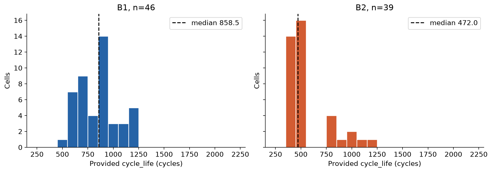

- **열화 곡선 — 확인한 결과:** 배치별 최소·최대 제공 라벨 셀을 비교하면, 초기 용량 수준이 비슷해도 후기 용량 감소 속도와 기록 종료 시점이 다릅니다. Batch 2의 짧은 라벨 셀 B2c19는 긴 라벨 셀 B2c34보다 이른 구간에 급격한 감소를 보입니다. 대표 셀 비교이므로 배치 전체의 열화 속도를 대표하는 통계는 아닙니다.

DAY 1의 [knee 탐색 결과](day1/output/knee_candidates.csv)는 B1 45/46셀, 후보 위치 중앙값 607사이클 / B2 39/39셀, 후보 위치 중앙값 356사이클입니다. 11점 이동 중앙값으로 완화한 뒤 연속 2구간 직선을 적합해, 단일 직선 대비 SSE가 25% 이상 줄고 후기 기울기가 음수이며 절댓값이 초기의 1.5배 이상일 때 후보로 표시했습니다. 탐색 기준에 따른 후보이며 물리적인 열화 시작점을 확정한 값은 아닙니다.

**모델 설계 시사점:** 초기 열화 속도를 요약하는 `QD_slope_10_100`을 후보로 사용했습니다. 전체 기록의 knee·종료 용량·기록 길이는 미래 정보이므로 모델 입력에서 제외했습니다. 아래 회색 영역만 입력 관측 기간이며, 0.88Ah 선은 절대 용량 참조 기준으로 각 셀 초기 용량의 80%와 동일하지 않습니다.

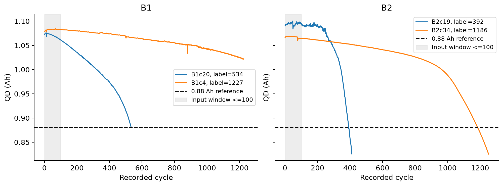

- **ΔQ(V) — 확인한 결과:** 장수명 그룹보다 중·단수명 그룹에서 `Q100−Q10`의 음의 변화 폭이 크게 나타납니다. Batch 1에는 <500 라벨 셀이 없어 단수명 곡선이 없습니다. Batch 1의 ΔQ 로그 분산과 제공 라벨은 Pearson r=-0.887로 강한 음의 선형 관계를 보였습니다.

**모델 설계 시사점:** 초기 곡선의 변화량을 `delta_logvar`로 요약해 핵심 후보로 채택했습니다. 확인된 Vdlin 축(3.5→2.0V)에서 공통 2.1~3.4V·500점으로 보간하고 `log10(var(ΔQ, ddof=0))`를 계산했습니다. 곡선의 띠는 그룹 IQR이며, 상관관계만으로 외부 배치 예측력을 보장하지 않습니다.

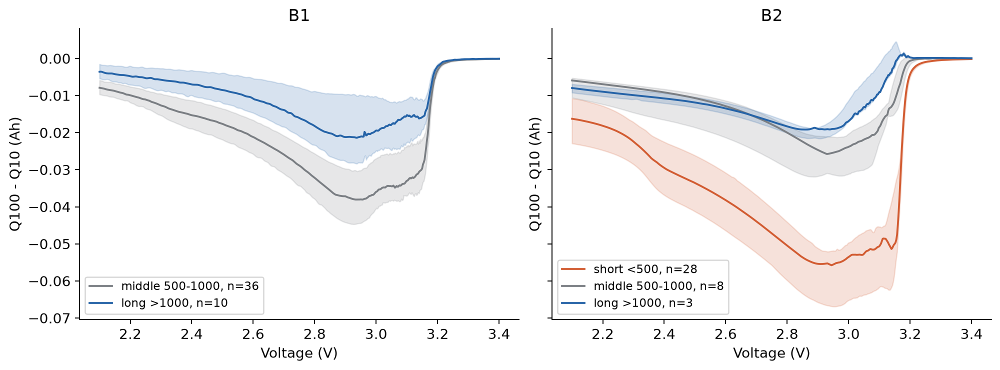

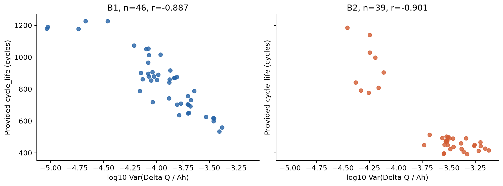

- **충전 조건 — 확인한 결과:** Batch 1에서 정책 평균 라벨은 `4C(80%)-4C` 1226.5사이클(n=2)부터 `5.4C(80%)-5.4C` 546.5사이클(n=2)까지 차이가 있습니다. 1단계 C-rate와 라벨은 r=-0.580, 초기 평균 충전시간과 라벨은 r=0.577입니다. 정책별 표본 수가 작고 전환 SOC·2단계 속도·다른 실험 조건도 달라, 빠른 충전의 인과효과로 단정하지 않습니다.

**모델 설계 시사점:** 충전시간을 후보로 사용하고, 정책의 C1·전환 SOC·C2 수치 분해와 범주형 처리 대안을 CV로 비교했습니다. 오차막대는 표준편차이며 1셀 정책은 변동성을 추정할 수 없습니다.

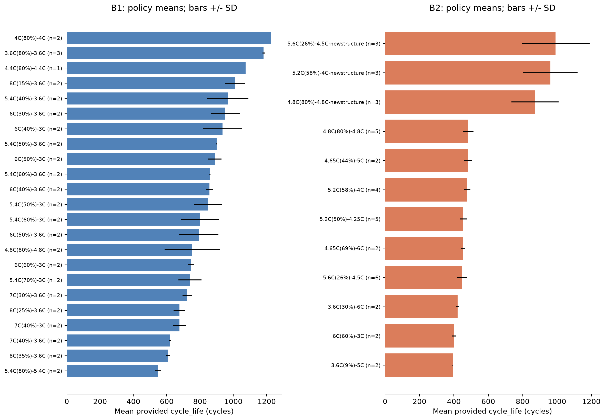

- **초기 신호·다중공선성 — 확인한 결과:** Batch 1에서 QD 기울기–라벨 r=0.524, 평균 온도–라벨 r=-0.482입니다. 별도로 학습 부분 36셀의 피처 간 상관을 확인하면 ΔQ 최소–평균 r=0.990, 평균–최고 온도 r=0.953로 중복 정보가 큽니다. 피처–타깃 관계와 피처끼리의 중복을 구분했습니다.

**모델 설계 시사점:** ΔQ 로그 분산·평균 온도를 대표 후보로 두고, 각 CV 학습 fold 안에서 상수·고상관 피처를 축소했습니다. Ridge의 중복 피처군 유지·제거 결과도 비교했으며, 결측 대치·선택·스케일링은 해당 학습 fold에만 fit했습니다.

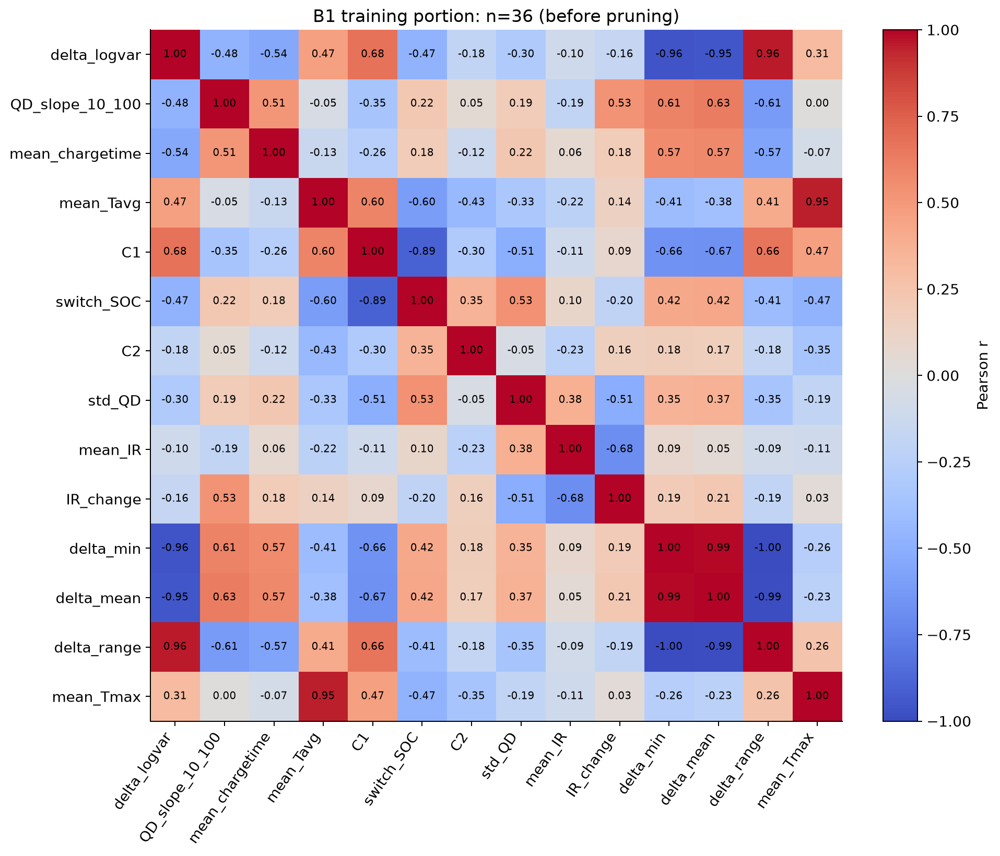

### 분석 코드 빠른 참조 — Scratch 기준

[30-ESSHealth-scratch.ipynb](30-ESSHealth-scratch.ipynb)의 실제 코드 위치와 재사용할 패턴입니다. 셀 번호는 **Markdown을 포함해 위에서부터 1번**으로 센 위치입니다. 위 결과 수치는 DAY 1·2의 정제·배치 비교 결과이며, 아래 표는 원본 Scratch의 코드 참고용입니다.

| 할 일 | 라이브러리·핵심 코드 | Scratch 위치 |
| --- | --- | --- |
| MATLAB 파일 읽기 | `mat73.loadmat(path)` → 실패 시 `scipy.io.loadmat(path, simplify_cells=True)` | Loading · 셀 3, 6 · `load_mat()` |
| 중첩 구조를 표로 변환 | `numpy.array()`, `pandas.DataFrame(records)`; dict-of-lists → list-of-dicts | 데이터 구조·Summary · 셀 8, 10, 12 · `to_list_of_dicts()`, `extract_summary()` |
| 기초 통계·결측·개수 확인 | `df.describe()`, `df.isnull().sum()`, `Series.nunique()` | 셀 14~16 |
| 셀별 수명 분포 | `df.drop_duplicates('cell_id')`, Matplotlib `Axes.hist()`, `Axes.boxplot()` | EDA 1 · 셀 18 |
| 셀별 열화 곡선 | 셀별 필터링 후 Matplotlib `Axes.plot(cycle, QD)`, `Axes.axhline()` | EDA 2 · 셀 21, 23 |
| 초기 IR과 수명 비교 | `df[df['cycle'] <= 10].groupby('cell_id')['IR'].mean()`, `merge()`, `Series.corr()`, `Axes.scatter()` | EDA 3 · 셀 26 |
| 정책별 평균·편차·표본 수 | `groupby('charging_policy')['cycle_life'].agg(['mean', 'std', 'count'])`, `sort_values()`, `Axes.bar(yerr=...)` | EDA 4 · 셀 29 |
| 초기 피처 집계·상관행렬 | 초기 100사이클 필터 → `groupby('cell_id').agg(...)` → `DataFrame.corr()` → `Axes.imshow()` | EDA 5 · 셀 33 |

**재사용 메모:** 사이클마다 반복된 수명 라벨은 셀당 한 행으로 줄인 뒤 분포·정책 평균을 계산합니다. 초기 피처는 먼저 관측 사이클을 제한한 뒤 집계합니다. Scratch의 로더는 코드상 `mat73`을 먼저 시도합니다. 셀 색상은 셀 순서로 부여되므로 장·단수명 색상으로 해석하지 않습니다. Scratch의 QD 하한 필터는 실제 말기 열화 구간도 제거할 수 있어 현재 분석에서는 그대로 사용하지 않았고, `0.88 * nominal`도 80% 기준으로 재사용하지 않습니다.

### Scratch 이후 추가한 분석

| 분석 | 라이브러리·핵심 코드 | 구현 위치 |
| --- | --- | --- |
| ΔQ 곡선·로그 분산·초기 기울기 | NumPy `interp()`, `var(ddof=0)`, `log10()`, `polyfit()`; 그룹 곡선은 `nanmedian()`, `nanquantile()` | [features.py](day2/src/features.py) · `load_features()`, `slope()` / [reporting.py](day2/src/reporting.py) · `make_figures()` |
| knee 후보 탐색 | pandas `rolling().median()`, NumPy `linalg.lstsq()`; 단일·2구간 직선 SSE 비교 | [DAY 1 노트북](day1/day1.ipynb) · 「2. 방전 용량 열화와 knee 탐색」의 `knee_candidate()` |
| 대용량 .mat 선택 로딩·공선성 축소 | `h5py.File()` / NumPy `corrcoef()`와 scikit-learn `Pipeline`, `SimpleImputer`, `StandardScaler` | [features.py](day2/src/features.py) · `read_array()`, `load_features()` / [modeling.py](day2/src/modeling.py) · `CorrelationPruner`, `build_model()` |

Scratch의 ΔQ 부분은 `cycles[n]['Qdlin']` 사용 힌트만 있으며 실제 계산·보간 코드는 DAY 1·2에서 추가했습니다. `mat73`은 Scratch의 로더용이고, 현재 DAY 2는 `h5py`로 필요한 필드를 읽습니다. 패키지 버전은 [requirements.txt](requirements.txt)를 참고합니다.

## Modeling

### 피처 엔지니어링 전략

입력 후보군은 `core`이며 전달된 변수는 `delta_logvar, QD_slope_10_100, mean_chargetime, mean_Tavg`입니다. 아래 표는 학습 부분에 최종 fit한 전처리에서 유지된 피처입니다. CV fold마다 공선성에 따라 유지 피처가 달라질 수 있으며 최종 피처만 먼저 선택해 CV를 다시 계산하지 않았습니다.

| 최종 피처 | 계산식 | 관측 사이클 | 단위 | 선정 근거 |
| --- | --- | --- | --- | --- |
| delta_logvar | log10(var(Q100-Q10, ddof=0)), 2.1..3.4V, 500 points | 10,100 | log10(Ah^2) | B1 r=-0.887; primary signal |
| QD_slope_10_100 | polyfit(cycle,QD,1)[0] | 10..100 | Ah/cycle | B1 r=0.524; initial slope |
| mean_chargetime | mean(positive chargetime) | 2..100 | dataset units | B1 r=0.577; charging process |
| mean_Tavg | mean(Tavg) | 2..100 | deg C | B1 r=-0.482; representative temperature |

QD는 비유한·0 이하·초기 2~10사이클 양수 중앙값의 1.3배 초과만 결측 처리하고, EOL 이하 용량을 일괄 제거하지 않았습니다. ΔQ 분산은 `ddof=0`이며 0·비유한값은 결측 처리합니다. 수치 결측은 학습 fold 중앙값으로 대치하고 상수·고상관 피처를 제거합니다. 기본 공선성 기준은 `|r|≥0.85`, 중복 피처 비교의 1.01은 상관 기반 제거를 비활성화한 설정입니다. 정책 문자열은 One-hot의 미관측 범주 무시 또는 CatBoost 범주 처리로 대응합니다.

| Ridge 피처군 | 공선성 기준 | 로그 타깃 | CV MAPE(%) | 표준편차(%p) |
| --- | --- | --- | --- | --- |
| delta | 0.850 | False | 9.578 | 3.952 |
| delta_qd | 0.850 | False | 10.257 | 3.920 |
| duplicates | 1.010 | False | 10.424 | 4.650 |
| core_category | 0.850 | False | 11.207 | 5.262 |
| core | 0.850 | False | 11.857 | 5.098 |
| duplicates | 0.850 | False | 11.857 | 5.098 |
| expanded | 0.850 | False | 12.156 | 5.920 |
| policy | 0.850 | False | 12.491 | 5.772 |

위 비교는 각 피처군 내에서 CV로 고른 최선 설정이며 통제된 단일 파라미터 효과의 인과실험은 아닙니다. 중복 피처를 남긴 Ridge의 CV가 더 낮은 경우도 있어 제거만으로 성능이 항상 개선된다고 결론 내리지 않습니다. 최종 모델의 4개 수치 피처는 상관 기준으로 제거되지 않았고, 학습 부분에서 대치 후 표준화한 행렬의 조건수는 2.549입니다. 전체 후보는 [model_comparison.csv](day2/output/model_comparison.csv), 피처 정의·채택/제외 근거는 [feature_design.csv](day2/output/feature_design.csv), 최종 축소 결과는 [final_feature_selection.csv](day2/output/final_feature_selection.csv)에 기록했습니다.

### 모델 선택 및 근거

- 후보 모델: 중앙값 기준, Ridge/Elastic Net, Random Forest/Extra Trees, CatBoost
- 최종 모델: **RandomForest**, 후보 `C118`
- 최종 설정: `{"max_depth": 2, "min_samples_leaf": 3}`, 로그 타깃 `True`, 공선성 기준 `0.85`
- 고정 설정: Random Forest/Extra Trees는 200개 트리와 random_state=42를 사용했습니다. 얕은 깊이·최소 leaf 표본 수로 소표본 과적합을 제한하고 로그 타깃의 효과는 원래 단위 MAPE로 비교했습니다.
- 선택 이유: 사전 정의한 181개 설정 중 **Batch 1 그룹 CV 평균 MAPE가 가장 낮았습니다**. 기준 모델 13.964% 대비 5.417%p 개선했고 fold 표준편차는 3.212%p입니다. Valid·Batch 2 결과로 모델을 바꾸지 않았습니다.

| 후보 모델 | 피처군 | 로그 타깃 | 선택 파라미터 | CV MAPE(%) | 표준편차(%p) |
| --- | --- | --- | --- | --- | --- |
| RandomForest | core | True | {"max_depth": 2, "min_samples_leaf": 3} | 8.547 | 3.212 |
| CatBoost | core_category | True | {"depth": 2, "l2_leaf_reg": 3.0} | 9.115 | 2.971 |
| Ridge | delta | False | {"alpha": 10.0} | 9.578 | 3.952 |
| ExtraTrees | core | False | {"max_depth": 4, "min_samples_leaf": 3} | 9.757 | 4.307 |
| ElasticNet | core | True | {"alpha": 0.1, "l1_ratio": 0.8} | 10.638 | 4.923 |
| Median | delta | False | {} | 13.964 | 6.472 |

선형 모델은 강한 ΔQ 신호·소표본·공선성에 대응하는 규제 후보, 트리는 비선형·상호작용 비교 후보, CatBoost는 정책 범주형 처리 후보로 선정했습니다. Ridge alpha는 0.01~100, Elastic Net alpha는 0.01/0.1/1과 l1_ratio 0.2/0.8, 트리 깊이는 2/4·최소 leaf 표본 수는 3/6, CatBoost 깊이는 2/4·l2_leaf_reg는 3/10을 비교했습니다. 로그 타깃은 역변환 후 MAPE를 계산했습니다. 정확한 전체 조합은 [search_space.json](day2/output/search_space.json)에 있습니다.

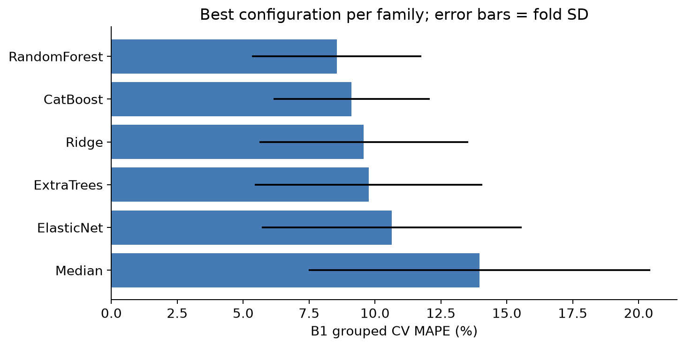

기존 seed=42 정책 hold-out 계획을 유지했습니다. 학습 36셀·18정책에서 5-fold GroupKFold로 선택하고, 별도 Valid 10셀·5정책과 Batch 2 39셀을 평가했습니다. 정책 그룹은 학습·검증 및 각 CV fold 사이에서 겹치지 않습니다. 동일 물리 셀의 독립성은 별도 실험 로그가 없어 완전히 보장하지 못합니다. [분할 목록](day2/output/split_manifest.csv)과 [fold별 점수](day2/output/cv_fold_results.csv)를 저장했습니다.

최종 모델은 hold-out을 제외한 Batch 1 학습 36셀에 fit했습니다. 전처리 → 모델의 동일 파이프라인으로 Valid·Test를 예측하고 Train은 OOF 예측을 저장했습니다. [최종 모델](day2/output/final_model.joblib)과 [실행 설정](day2/output/run_config.json)으로 재현할 수 있습니다. CV 점수는 후보 선택에도 사용됐으므로 검색으로 인한 낙관성이 남습니다.

## 성능 결과

`MAPE(%) = 100 × mean(|y−ŷ|/|y|)`이며 타깃은 제공 `cycle_life`입니다.

| 구분 | MAPE (%) | 비고 |
| --- | --- | --- |
| Train (Batch 1 CV) | 8.547 | 5-fold 그룹 CV 평균; 36셀·18정책 |
| Valid (Batch 1 Hold-out) | 15.584 | 10셀·5정책 |
| Test (Batch 2) | 45.504 | 39셀; Batch 1 CV로 선택한 최종 모델 평가 |
| Gap (Train-Valid) | +7.037 | (+) : 과적합 의심 |
| Gap (Valid-Test) | +29.920 | (+) : 배치간 일반화 저하 의심 |
| Gap (Target-Test) | +36.404 | Target : 원논문 9.1% |

Batch 1 그룹 CV 8.547%, hold-out 15.584%, Batch 2 45.504%입니다. 과제 비교 목표 9.1%에 대해 목표에 미달합니다. 표의 Gap은 퍼센트포인트(%p)이며 각각 Valid−Train, Test−Valid, Test−Target으로 계산합니다. 양수는 오차 증가·목표 미달입니다. Train–Valid 차이는 과적합뿐 아니라 hold-out의 수명·정책 이동도 반영합니다. Valid 라벨 범위는 534~757, 학습은 636~1227입니다.

| 구분 | 셀 수 | Pooled MAPE(%) | MAE(사이클) | RMSE(사이클) | R2 |
| --- | --- | --- | --- | --- | --- |
| Train OOF | 36 | 8.793 | 80.025 | 104.321 | 0.602 |
| Valid | 10 | 15.584 | 97.875 | 105.264 | -0.962 |
| Test | 39 | 45.504 | 216.582 | 228.619 | -0.086 |

Train 주지표는 5개 fold MAPE의 단순 평균이고 위 보조 표는 셀별 OOF를 합친 MAPE입니다. fold 크기가 달라 두 값은 다를 수 있습니다. 원논문 로더의 Batch 2는 2017-06-30이고 과제·로컬 Batch 2는 2018-02-20입니다. 원논문 분할·라벨·전처리와 동일 조건의 재현이라고 주장하지 않으며 9.1%는 과제 비교 기준으로 사용했습니다.

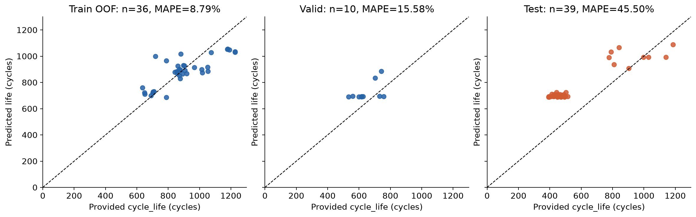

## 오류 분석

Batch 2 평균 예측−라벨은 201.783사이클로 과대예측 방향입니다. 수명 구간별 성능은 다음과 같습니다.

| 수명 구간 | 셀 수 | MAPE(%) | MAE(사이클) | 평균 예측−라벨(사이클) |
| --- | --- | --- | --- | --- |
| long >1000 | 3 | 8.280 | 94.301 | -94.301 |
| middle 500-1000 | 8 | 22.519 | 151.976 | 150.557 |
| short <500 | 28 | 56.059 | 248.142 | 248.142 |

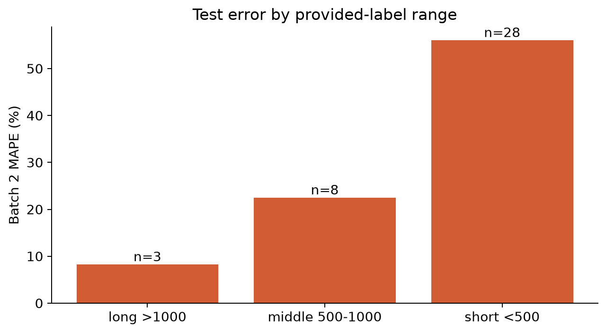

절대백분율오차가 큰 Batch 2 셀의 상위 5개입니다.

| 셀 | 정책 | 실제 제공 라벨 | 예측 | 절대백분율오차(%) |
| --- | --- | --- | --- | --- |
| B2c6 | 3.6C(9%)-5C | 393.000 | 693.005 | 76.337 |
| B2c19 | 6C(60%)-3C | 392.000 | 689.175 | 75.810 |
| B2c15 | 3.6C(9%)-5C | 396.000 | 689.239 | 74.050 |
| B2c30 | 5.6C(26%)-4.5C | 412.000 | 710.546 | 72.463 |
| B2c21 | 6C(60%)-3C | 408.000 | 693.005 | 69.854 |

큰 오차 셀의 정책·측정 구조·라벨 구간과 평균 잔차를 [정책별 오류](day2/output/errors_by_policy.csv), [구조별 오류](day2/output/errors_by_new_structure.csv), [미관측 정책별 오류](day2/output/errors_by_unseen_policy.csv)에서 확인합니다. 라벨 정의·분포 이동·미관측 정책은 가능한 원인 가설이며 단독 원인으로 확정하지 않습니다. 개선 방향은 일관된 실제 EOL 라벨 확보, 더 다양한 학습 정책·짧은 수명 셀 수집, 별도 배치 재검증입니다. 이 분석 후 Batch 2에 맞춰 재튜닝하지 않았습니다.

**구체적인 오류 패턴:** 상위 5개 셀은 모두 500사이클 미만 라벨·미관측 정책·`newstructure` 접미사 없음이라는 공통점이 있습니다. 학습 최소 라벨은 636인데 Batch 2의 30/39셀이 그보다 짧으며, Batch 2 예측 범위는 687.9~1088.3사이클로 짧은 셀의 수명을 과대예측했습니다. Random Forest의 leaf 평균과 로그 역변환은 학습 타깃 범위 밖으로 수명을 외삽하지 못하는 구조입니다. 따라서 학습에 없는 짧은 수명 구간과 모델의 외삽 한계가 맞물렸음을 확인할 수 있습니다.

미관측 정책 셀의 MAPE는 45.490%, 학습에 등장한 정책 셀은 45.595%로 비슷합니다. 미관측 정책만으로 큰 오차를 설명하지 않습니다. `newstructure`가 없는 30셀은 MAPE 54.950%, 접미사가 있는 9셀은 14.016%입니다. 구조 그룹은 수명 분포도 다르므로 이 차이를 구조 변경의 인과효과로 해석하지 않습니다.

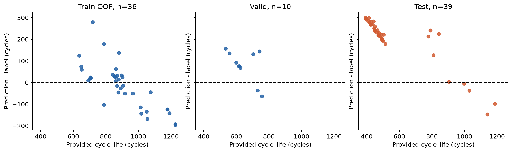

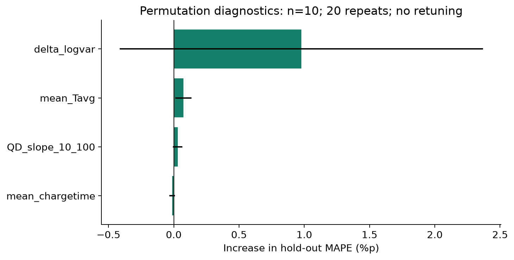

중요도는 최종 모델 확정 후 Valid 10셀에서 20회 순열로 산출한 설명용 진단입니다. 막대는 MAPE 증가, 오차막대는 반복 표준편차이며 음수도 가능합니다. 소표본·상관 피처 영향이 있어 인과적 기여도나 안정적인 순위로 단정하지 않습니다.

## ESS 도메인 해석

- 활용 가능성: 초기 열화 신호를 점검·추가 실험 대상 선정과 교체 계획의 참고 정보로 검토할 수 있습니다. 제공 라벨의 차이와 외부 성능을 고려할 때 자동 교체 시점 결정에 바로 적용할 근거는 부족합니다.
- 개발 한계: 소표본, 학습·검증·외부 배치의 분포 차이, Batch 1 종료+1 라벨, 물리 셀 중복 식별 불확실성이 있습니다. DAY 1에서 Batch 1 전체와 Batch 2를 탐색했다는 평가 독립성의 한계도 남습니다.
- 실 배포에 필요한 검증: 동일한 명목 용량·EOL 기준과 미완주/검열 여부, 실제 셀 식별자·실험 로그를 확보하고, 실제 ESS의 온도·부하·팩 조건에서 외부 검증과 예측 불확실성 평가를 해야 합니다. 실제 EOL 라벨 확보 또는 검열을 반영한 수명 모델은 후속 연구 과제입니다.
- 운영 범위: 초기 100사이클 관측이 필요하며 이번 외부 평가는 Batch 2에 한정합니다. 비용 절감·현장 운영 개선을 달성했다고 주장하지 않습니다.

## 참고문헌

- Severson et al. (2019). Data-driven prediction of battery cycle life before capacity degradation. *Nature Energy*, 4, 383–391.
- [과제 제공 데이터셋](https://www.kaggle.com/datasets/itshpark/data-driven-prediction-of-battery-cycle)
- [실습 가이드](https://actually-war-1ea.notion.site/DS-Mini-Project-32d7f4c8669380338a27f90c471c1fcb)

## 팀 구성

- 신현중 (울산 3반): EDA, 피처 엔지니어링, 파이프라인·후보 모델 개발, 성능 평가(Batch 2), 오류·도메인 해석
