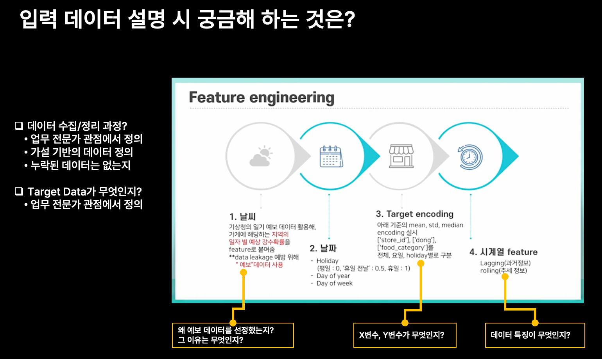
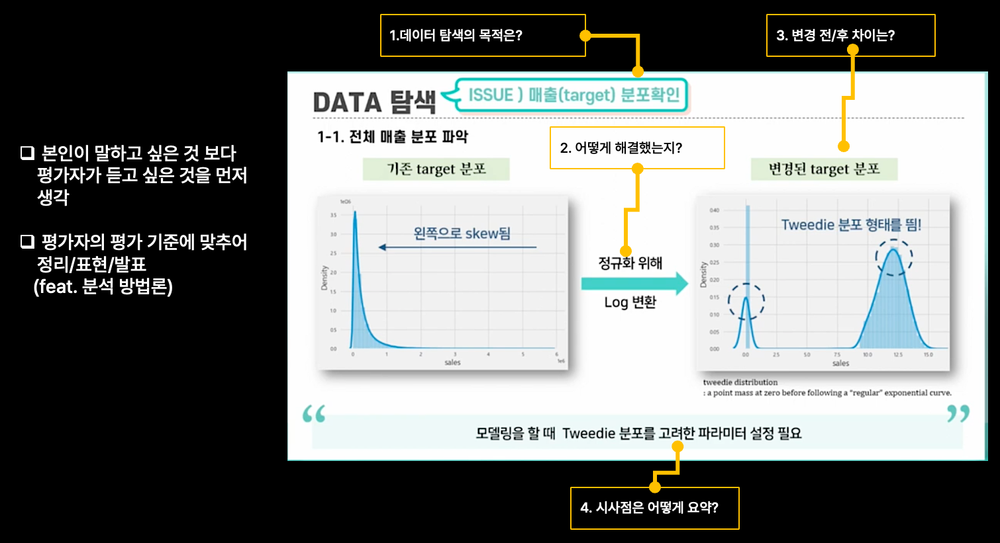
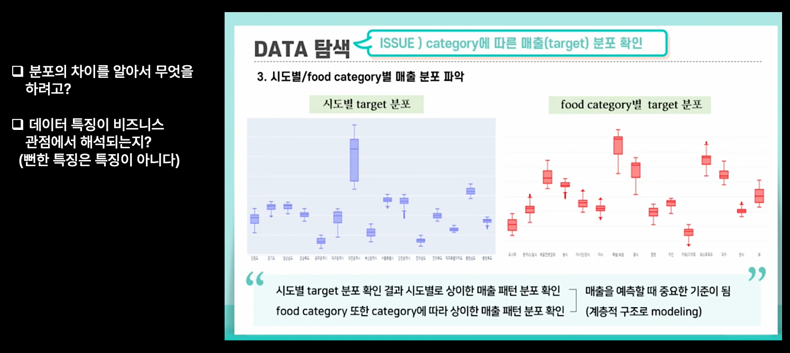
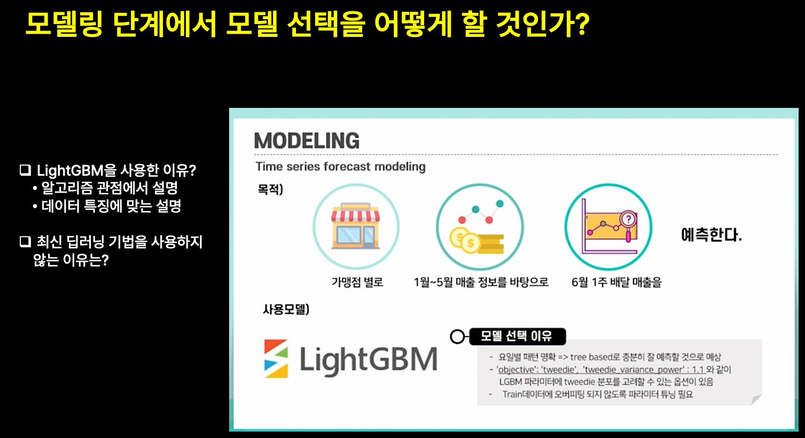

# Domain : 베터리, ESS
## ESS - 전력망 베터리
### Battery Index

- State
    - SOC, State of Charge
        - SOC = 현재 충전량 / 최대 충전 가능 용량 * 100 (%)
        - 배터리에 지금 얼마나 충전되어 있는지 (스마트폰 배터리 잔량과 동일한 개념)
        - BMS가 SOC를 기반으로 충방전 제어 및 과충방전 방지
    - SOH, State of Health
        - SOH = 현재 용량 / 초기 용량 * 100 (%)
        - 배터리가 얼마나 건강한지, SOH 80% 이하 → ESS 교체 기준
        - 100 사이클 후 SOH=95% → 아직 5% 열화
    - SOP, State of Power
        - SOP = 현재 출력 가능한 최대 전력 (W)
        - 지금 ESS가 얼마나 빠르게 충방전할 수 있는가
        - SOP 감소 → 피크 대응 능력 저하 신호
- Derived
    - RUL, Remaining Useful Life
        - RUL = EOL 도달까지 남은 사이클 수
        - 언제 교체해야 하는가? → 예지 보전 (PdM)의 핵심 타겟

### 배터리 교체 비용 = CAPEX 30~40%

- 예측 없이 운영하면
    - 갑자기 배터리 수명 종료 → 예기치 못한 설비 중단
    - 과도한 예방적 교체 → 불필요한 비용 발생
    - 용량 저하 예측 실패 → 피크 대응 불가 → 계약 위약금
    - ESS 1MWh 기준, 셀 교체 비용 $30,000 ~ $80,000
- 데이터 기반 수명 에측
    - 초기 100 사이클만으로 전체 수명 예측 가능
    - 최적 교체 시점을 사전 계획 가능 → 운영 비용 20~35% 절감
    - 열화 속도 예측 → 충방전 전략 최적화
    - 배터리 제조사 수율 선별 → 팩 구성 최적화

### Regression - 배터리 수명 예측

- 초기 100 사이클 데이터만으로 배터리의 총 잔여 수명 충전(사이클 수) 예측
- 데이터 : 초기 100 사이클
- Target : `cycle_life` - EOL(80% SOH 도달)까지의 총 사이클 수
- 성능 : 테스트 오차 9.1%

### Classification - 배터리 수명 분류 (Binary)

- 단 5 사이클만으로 배터리의 장/단 수명을 즉시 선별 → 제조 직후 빠른 스크리닝 목표
- 데이터 : 초기 5 사이클
- Target : `cycle_life` 이진화한 파생 변수로 정의
    
    ```python
    # cycle_life 기준 550사이클로 이진 레이블 생성
    df['label'] = (df['cycle_life'] >= 550).astype(int)
    # 1 = 장수명(Long-life), 0 = 단수명(Short-life)
    ```
    
- 성능 : 테스트 오차 4.9% (1-Accuracy)

### Features

- Descriptors : 배터리 수준 스칼라
    - `cycle_life` : EOL(80% 용량)까지 총 사이클 수 ⇒ Target Variable
    - `charging_policy` : 충전 프로토콜 (e.g. : `"4.8C(80%)-3.6C"`- 용량의 80%까지 4.8C 속도로 빠르게 충전하고, 이후 나머지는 3.6C로 천천히 충전한다)
- Summary : 사이클별 요약 스칼라
    - `QD` : 방전 용량 (Ah)
    - `Qc` : 충전 용량 (Ah)
    - `IR` : 내부 저항 (Ohm)
    - `Tmax` / `Tavg` / `Tmin` : 사이클 내 최고, 평균, 최저 온도
    - `chargetime` : 충전 소요 시간
    - `discharge_time` : 방전 소요 시간
- Cycles : 사이클 내부 시계열
    - `t` : 시간 (분)
    - `V` : 전압 (V)
    - `I` : 전류 (A)
    - `T` : 온도 (°C)
    - `Qc`/ `Qd` : 충전/방전 용량
    - `Qdlin` : `ΔQ(V)` 곡선 계산의 기반 데이터, 전압 축으로 선형 보간된 방전 용량 (1,000포인트, 2V ~ 3.6V)
    - `Tdlin` : 전압 축으로 선형 보간된 온도 (1,000 포인트)
    - `discharge_dQdV` : 방전 dQ/dV 곡선 (파생변수)

# 🧑‍💻 TASK

- Dataset : https://www.kaggle.com/datasets/itshpark/data-driven-prediction-of-battery-cycle
    
    
    | File | Batch | 활용  |
    | --- | --- | --- |
    | 2017-05-12 (2.8GB) | Batch 1 | 원논문의 학습 데이터셋  |
    | 2018-02-20 (1.9GB) | Batch 2 | 원논문의 1차 테스트셋 |
    | 2018-04-03 varcharge (0.1GB) | extra | 충전 최적화 실험용 - 다른 논문 (Attia 2020) 데이터셋 |
    | 2018-04-12 (3.0GB) | Batch 3 | 원논문의 2차 테스트셋 |
- Scratch :
    
    30-ESSHealth-scratch.ipynb
    

## DAY 1 - 모델 전략 수립

- 대상 Dataset = Batch 1 + Batch 2 + Batch 3
- 아래 5개 질문에 대하여 각 Batch Set에 대한 EDA를 수행하고 Batch간 특징을 비교함
- EDA insight를 토대로 모델 설계 전략 수립

### Question

1. Cycle Life 분포는 어떻게 생겼는가? 
    - 150 ~ 2,300 사이클 Histogram
    - 장수명(>1,000)/단수명(<500) 비율 확인
    - 이상치 셀 식별 - 왜 유독 짧은가?
2. 열화 곡선 - 방전 용량이 어떻게 감소하는가?
    - 사이클 별 Qd 추이 시각화
    - 열화 속도가 일정한가, 가속되는가?
    - Knee point - 급격한 열화 시작점 탐색
3. ΔQ(V) ****곡선 - 초기 사이클에서 차이가 보이는가?
    - 사이클 100번 - 사이클 10번의 Q(V) 차이 계산
    - 장수명 셀 vs 단수명 셀의 ΔQ 형태 비교
    - 이를 구분할 수 있는 통계값으로 피쳐 추출
4. 충전 조건 (C-rate)과 수명의 관계는?
    - 충전 프로토콜별 평균 수명 비교
    - 고속 충전 셀이 정말 수명이 짧은가?
    - 충전 전류 패턴과 열화 속도 상관 분석
5. 상관관계 - 어떤 신호가 수명과 연관되어 있는가?
    - 초기 사이클 피켜들과 Cycle Life 상관 계수 확인
    - 가장 강한 관계 식별
    - 멀티클리니어리티 문제 확인

### 모델 설계 전략

1. Feature Engineering : EDA에서 발견한 내용 토대로 유의미한 변수 선별 
2. Regression vs Classification 
    - 논문에서는 두 가지 모델링 모두 진행
    - 과제에서는 하나의 방법만 선택하고, 이를 설명하는 Target Variable 선정
3. Modeling Strategy : **확인된 데이터 특성 기반으로** 모델링 전략(데이터 처리, 후보 모델 선정 등)을 제시


## DAY 2 - 모델 개발 및 평가

모델 설계 전략을 기반으로 **최적의 모델을 개발**하고, 논문에서 제시한 성능(Target)과 비교

- Modeling (mandatory)
    - Batch 1을 학습 데이터셋으로, Batch 2를 테스트 데이터셋
- additional (not mandatory)
    - 개발한 최적 모델로 Batch 3 테스트 데이터셋으로 추가 성능 검증
    - 단 Batch 3 데이터셋은 배치 간 차이 있어 성능이 떨어질 수 있음
    - Batch 3 :
        - Cycle Life 분포가 배치 별로 상이 : Batch 1/2는 유사하지만, Batch 3는 분포 차이 있음
        - 충전 커브 시작 시점이 배치별로 상이 : `Qdlin` 변수를 단순 비교하면 왜곡 발생
        - 이상치 제거 고려 : 배치 수집 시기 사이에 수개월 공백이 있어, 일부 셀은 데이터 품질 문제로 원논문에서도 제거됨

### Performance Reporting

모델 성능은 아래 항목으로 구분하며, Format 맞춰 작성함 

- Index :
    - Train (Batch 1 CV) : Batch 1 내 Cross-Validation 평균 성능
    - Valid (Batch 1 Hold-out) : Batch 1 내 Hold-out 검증 성능
        - Valid를 CV가 아닌 Hold-out으로 사용하는 이유 :
            - 배터리 데이터는 셀 단위로 독립적이며, 각 셀이 서로 다른 충전 프로토콜(C-rate)로 실험됨
            - 이 경우 CV를 적용하면 동일 프로토콜 셀이 train/valid에 나뉘어 들어가 데이터 누수(leakage) 위험 잔존
            - Hold-out은 셀 단위 분리를 명확히 보장하며, 배치 간 일반화를 평가하는 이번 프로젝트 구조에서 더 적합
    - Test (Batch 2) : Batch 2 최종 평가 성능
    - Gap (Train-Valid) : Train 과적합 확인
    - Gap (Valid-Test) : 배치 간 일반화 차이 확인
    - Gap (Target-Test) : 원논문 성능 대비 차이
      - 원논문 성능 : Regression 9.1%(MAPE), Classification 4.9%(1-Accuracy)
      - Performace Metric
        - Regression : MAPE
        - Regression : F1-Score, Accuracy

- Format :
    - Reporting format (for Regression)
        
        
        | 구분 | MAPE (%) | 비고 |
        | --- | --- | --- |
        | Train (Batch 1 CV) |  |  |
        | Valid (Batch 1 Hold-out) |  |  |
        | Test (Batch 2)  |  |  |
        | Gap (Train-Valid)  |  | (+) : 과적합 의심 |
        | Gap (Valid-Test) |  | (+) : 배치간 일반화 저하 의심 |
        | Gap (Target-Test) |  | Target : 원논문 9.1%  |
        
    - Reporting format (for Classification)
        | 구분 | F1-Score | Accuracy | 비고 |
        | --- | --- | --- | --- |
        | Train (Batch 1 CV) |  |  |  |
        | Valid (Batch 1 Hold-out) |  |  |  |
        | Test (Batch 2)  |  |  |  |
        | Gap (Train-Valid)  |  |  | (+) : 과적합 의심 |
        | Gap (Valid-Test) |  |  | (+) : 배치간 일반화 저하 의심 |
        | Gap (Target-Test) |  |  | Target : Accuracy 95.1%  |

# ✍️ Deliverables

- 모든 산출물은 반별 채널, slack thread로 제출
- 모델 전략 수립 (DAY 1)
    - EDA Question에 대하여 확인한 내용에 대하여 정리
        - 그래프 나열식 안됨 ❌
        - 확인한 핵심 내용(그래프 + 해석) & 시사점 도출❗
    - 모델 설계 전략 중
        - Modeling Strategy는 후보 모델을 list-up 하되, EDA 시사점과 연결되도록 작성
    - (참고) EDA to Model Strategy :
        - 주제 : 시계열 데이터를 활용한 배달 매출 예측 분석
        - INPUT
            
        - EDA
            
            
        - 데이터 기반의 모델링 전략 수립
            
  - 제출 :
      - `DS-MINI-Design-{캠퍼스_X반}-{이름1+이름2}.pdf`
      - 마감 : DAY1, 17시

- 모델 전략 수립 (DAY 2)
  - Github
      - `README.md`는 아래 샘플 참고하여 간결하고 명확하게 작성 (sample.md 참조)
  - 원논문과 비교한 성능 지표 반영 - GAP(Target-Test) : Batch 2 대상
  - 제출 :
      - Github Link (public)
      - 마감 : DAY2, 16시

# 📝 Evaluation Criteria
- (참고) 산출물 평가 항목 :

| 구분 | 평가항목 | 평가 내용 | 배점 | 총점 |
|---|---|---|---:|---:|
| 모델 전략 수립 | EDA | • 핵심 변수 분포 탐색<br>• 통계량 확인 및 해석<br>• Feature Selection & Engineering | 50 | |
| 모델 전략 수립 | EDA → 전략 연결성 | • EDA 기반으로 시사점 도출<br>• 연결 논리의 일관성 | 30 | |
| 모델 전략 수립 | 모델링 전략 수립 | • Feature 설계 논리<br>• 모델 선택 논리 | 20 | **100** |
| 모델 개발 및 평가 | 전략 → 구현 반영 | • 전략 기반으로 Feature 및 모델 구현 | 20 | |
| 모델 개발 및 평가 | Pipeline 개발 | • 개발 파이프라인<br>• 데이터 분할 적절성<br>• 핵심 변수 구현 | 40 | |
| 모델 개발 및 평가 | 성능 리포팅 및 해석 | • 성능 정리 (포맷 기반)<br>• 목표 성능 대비 Gap 해석력 | 20 | |
| 모델 개발 및 평가 | 분석 결과 해석 | • 분석 결과의 도메인 관점 해석<br>• 개발 한계점 도출 | 20 | **100** |